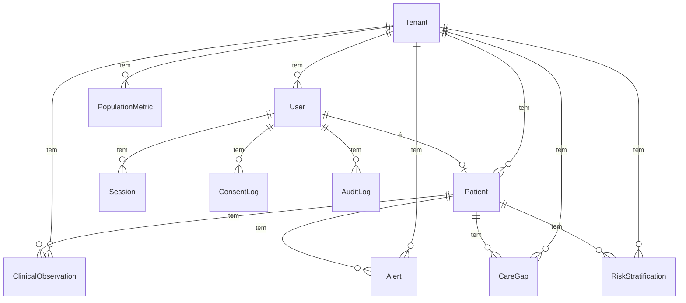

# ARQUITETURA — Lifecode SaMD Platform

---

## Fluxo Principal

```mermaid
flowchart TD
    PAC[Paciente\nApp Mobile\nExpo Router] -->|POST /api/v1/observations/glucose\nX-Tenant-ID + Bearer JWT| NGINX

    NGINX[Nginx Reverse Proxy\nRate Limiting + TLS + Headers OWASP] --> API

    subgraph API ["API NestJS (apps/api) — Porta 3000"]
        TG[TenantGuard\nvalida X-Tenant-ID] --> RG
        RG[RolesGuard\nverifica Role no JWT] --> GS
        GS[GlucoseService\nidempotência + validação] --> TR
        TR["$transaction Prisma\ngrava ClinicalObservation\n+ Motor de Regras"]
        TR -->|valor < 54 ou sintomas críticos| AL[cria Alert P0/P1]
        TR -->|valor OK| LOG[AuditLog com HMAC]
    end

    API -->|DATABASE_URL| PG[(PostgreSQL 16\n+ pgvector)]
    API -->|REDIS_URL| RD[(Redis 7\nFilas / Cache)]

    subgraph PORTAL ["Portal Web (apps/web) — Next.js"]
        OP[/operator/dashboard\nEstratificação US-21] 
        CG[/operator\nLacunas US-22]
    end

    PORTAL -->|GET /api/v1/operator/analytics/*| API

    MOBILE[App Mobile\nTela de Histórico\nUS-07] -.->|NÃO IMPLEMENTADO| API

    QUEUE[Fila de Atendimento\n/alerts — Portal Profissional] -.->|NÃO IMPLEMENTADO| API

    PG -.->|FHIR R4 typing| FHIR[(Tipos FHIR\npacakges/shared/src/fhir.ts\nSó tipagem, sem servidor)]
```

---

## Modelo de Dados

### Entidades e Relacionamentos



### Tabelas com dado identificável de paciente (⚠️ LGPD)

| Tabela (`@@map`) | Dados Sensíveis | Retenção mínima |
|---|---|---|
| `users` | `email`, `passwordHash`, `cpf`, `phone` | Duração do contrato + 5 anos |
| `patients` | `birthDate`, `gender`, `diabetesType`, `emergencyContactPhone` | 20 anos (CFM) |
| `clinical_observations` | valores glicêmicos com `patientId` | 20 anos (CFM) |
| `consent_logs` | log de aceite TCLE com IP e assinatura | 10 anos |
| `audit_logs` | ações com IP, `userId` e HMAC | 5 anos (ANS) |
| `sessions` | `tokenHash`, `ipAddress`, `userAgent` | Duração da sessão + 90 dias |

---

## Contratos de API

### Autenticação

| Método | Endpoint | Auth | Body | Response |
|---|---|---|---|---|
| POST | `/api/v1/auth/register` | Nenhuma | `{ tenantId, email, password, fullName, role, cpf? }` | `{ accessToken, refreshToken, user }` |
| POST | `/api/v1/auth/login` | Nenhuma | `{ tenantId, email, password }` | `{ accessToken, refreshToken, user }` |
| GET | `/api/v1/auth/me` | Bearer JWT | — | `{ user }` |

### Observações Clínicas

| Método | Endpoint | Auth | Body | Response |
|---|---|---|---|---|
| POST | `/api/v1/observations/glucose` | Bearer JWT + X-Tenant-ID | `IngestGlucoseDto` (ver DTO) | `{ status: 'CREATED'\|'IDEMPOTENT_SKIPPED', data, alertTriggered? }` |

**`IngestGlucoseDto` campos:**
```typescript
{
  patientId: string (UUID),
  externalEventId: string,       // chave de idempotência
  value: number (10–1000),
  unit: 'mg/dL' | 'mmol/L',
  sourceType: MeasurementSource,
  context?: MeasurementContext,
  deviceId?: string,
  measuredAt: string (ISO 8601 UTC),
  symptomsReported?: {
    confusionOrAlteredConsciousness?: boolean,
    sweatingOrTremors?: boolean,
    vomitingOrKetoneSigns?: boolean
  },
  notes?: string (max 500 chars)
}
```

### Analytics da Operadora

| Método | Endpoint | Auth | Response |
|---|---|---|---|
| GET | `/api/v1/operator/analytics/overview` | Bearer JWT + X-Tenant-ID | `{ population, riskTiers, careGapsSummary }` |
| GET | `/api/v1/analytics/risk-summary` | Bearer JWT + X-Tenant-ID | Estratificação por tier |
| GET | `/api/v1/analytics/care-gaps` | Bearer JWT + X-Tenant-ID | Lista priorizada de gaps vencidos |
| GET | `/api/v1/analytics/utilization` | Bearer JWT + X-Tenant-ID | Métricas de PA/internações (hardcoded no piloto) |

### Sistema

| Método | Endpoint | Auth | Response |
|---|---|---|---|
| GET | `/api/v1/health` | Nenhuma | `{ status: 'ok', timestamp }` |
| GET | `/api/docs` | Nenhuma | Swagger UI interativo |

---

## Integrações Externas

| Serviço | Para quê | Código do cliente | O que acontece se cair |
|---|---|---|---|
| PostgreSQL 16 + pgvector | Banco principal de dados clínicos | `packages/database/prisma/` via `PrismaClient` | API retorna 503 — sem fallback implementado |
| Redis 7 | Cache de sessões, filas de alertas futuras | Configurado em `docker-compose.yml` mas sem BullMQ ainda integrado | API continua operando (Redis não é crítico no estado atual) |
| Mailpit (dev) / SMTP (prod) | Envio de e-mails de alertas | DESCONHECIDO — referenciado nas variáveis de ambiente mas sem módulo de e-mail implementado | DESCONHECIDO |
| Dexcom/Libre (futuro) | Ingestão automática de dados CGM | Não existe — apenas enums no schema | N/A |
| Servidor FHIR R4 (futuro) | Interoperabilidade com outros sistemas | Não existe — apenas tipagem TypeScript em `packages/shared/src/fhir.ts` | N/A |

---

## Autenticação, Autorização e Permissões

### Fluxo de Auth
1. Cliente envia `POST /api/v1/auth/login` → recebe `accessToken` (JWT)
2. Todas as rotas protegidas exigem: `Authorization: Bearer <token>` + `X-Tenant-ID: <uuid>`
3. `JwtAuthGuard` → valida o token e popula `req.user`
4. `TenantGuard` → verifica se o `tenantId` do token bate com o header
5. `RolesGuard` → verifica se o role do usuário está na lista `@Roles(...)` do endpoint

### Papéis (Role enum)

| Role | Descrição | Acesso esperado |
|---|---|---|
| `PACIENTE` | Usuário final do app mobile | Apenas próprios dados |
| `CUIDADOR` | Familiar/cuidador do paciente | Dados do paciente vinculado |
| `MEDICO` | Médico/endocrinologista | Portal profissional, fila de alertas |
| `NAVEGADOR` | Enfermeiro/navegador de cuidados | Fila de alertas, ações de follow-up |
| `GESTOR_CLINICA` | Gestor da clínica/hospital | Relatórios da clínica |
| `ANALISTA_OPERADORA` | Analista da operadora de saúde | Portal da operadora, analytics populacionais |
| `ADMIN` | Administrador do tenant | Acesso total |

---

## Decisões de Arquitetura Tomadas

### 1. Monorepo com pnpm workspaces + Turborepo
**Decisão**: Um único repositório com `apps/` e `packages/`.  
**Porquê**: Compartilhar tipos (`@lifecode/shared`) e schemas Zod entre API, Web e Mobile sem duplicação. Turborepo paraleliza e faz cache dos builds.  
**Alternativa descartada**: Três repositórios separados — rejeitado porque a sincronia de tipos entre repos é lenta e propensa a divergência.

### 2. NestJS Monólito Modular (não microserviços)
**Decisão**: Um único processo NestJS com módulos internos separados por domínio.  
**Porquê**: Equipe pequena de piloto. Microserviços adicionariam latência de rede e complexidade operacional sem ganho real para <50k pacientes.  
**Alternativa descartada**: Microserviços por domínio (Observations, Alerts, Analytics) — viável na fase de escala, não agora.

### 3. Zod como fonte de verdade de tipos + class-validator nos DTOs
**Decisão**: Schemas Zod em `packages/shared` definem os tipos canônicos. DTOs da API usam `class-validator` decorators.  
**Porquê**: `createZodDto()` do `nestjs-zod` é incompatível com TypeScript 5.x quando o schema usa `.transform()` (erro TS2509). A duplicação é um tradeoff aceito.  
**Alternativa descartada**: `createZodDto()` como base — causava falha de build.

### 4. Multi-tenancy via coluna `tenantId` (Row-Level)
**Decisão**: Toda tabela tem `tenantId`. Isolamento é feito em código (não no banco via RLS).  
**Porquê**: Flexibilidade para evoluir para RLS posteriormente sem migração de schema.  
**Alternativa descartada**: Schema separado por tenant no PostgreSQL — complexidade de migrations multiplicada.

### 5. SaMD sem servidor FHIR R4 externo no piloto
**Decisão**: Usar os tipos FHIR R4 em TypeScript mas armazenar no modelo relacional próprio.  
**Porquê**: Integração com servidor FHIR (HAPI FHIR, Azure Health) é cara e desnecessária para o piloto com poucas clínicas.  
**Alternativa descartada**: Armazenar recursos FHIR como JSON no Postgres — avaliado, pode ser retomado na fase de interoperabilidade.

### 6. `.npmrc` com `shamefully-hoist=true`
**Decisão**: Forçar o pnpm a criar `node_modules` flat dentro do Docker.  
**Porquê**: O TypeScript (`tsc`) não resolve módulos via o virtual store do pnpm quando rodando dentro de containers Alpine sem symlinks configurados.  
**Alternativa descartada**: Usar `paths` no `tsconfig.json` para mapear os pacotes — causava erros TS5011 (rootDir inválido) e TS5102 (baseUrl removido no TS5).
